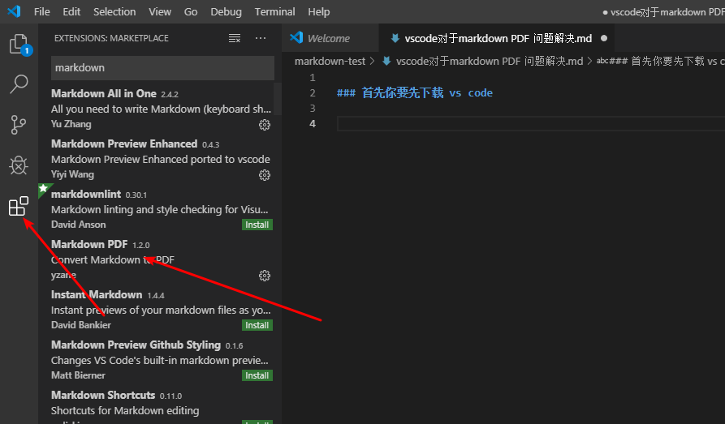
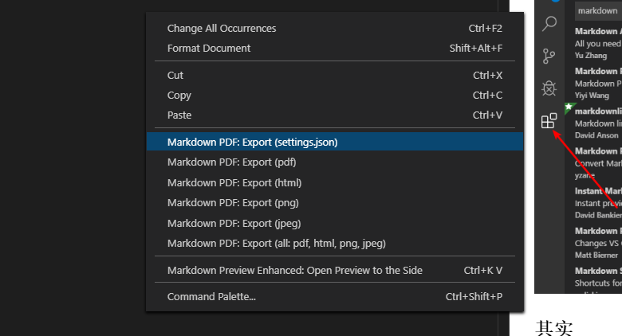
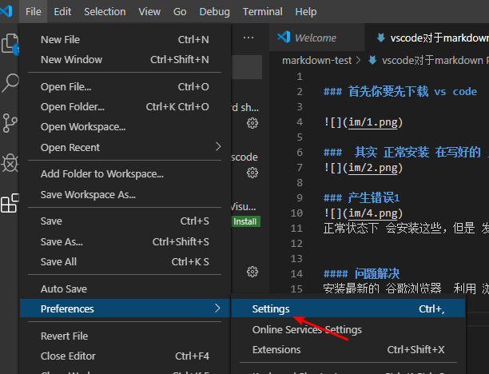
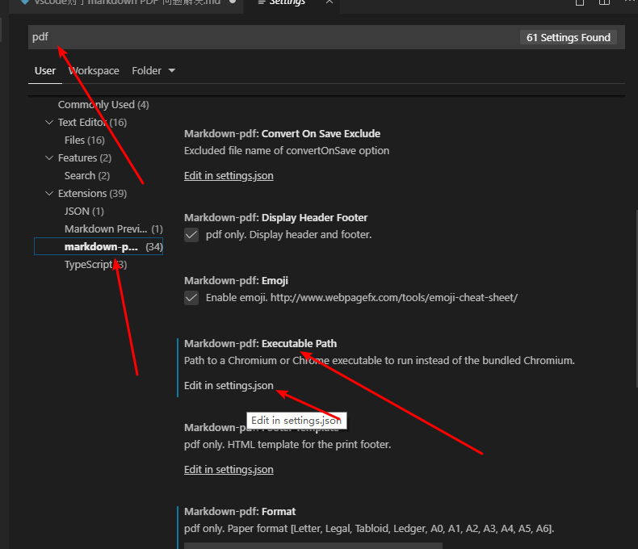
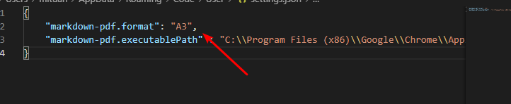
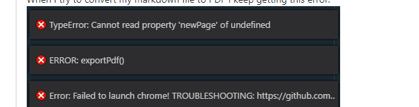

### 首先你要先下载 vs code   

    

###  其实 正常安装 在写好的 ,md 文件中 右键就可以处理身材 pdf 文件  
   

### 产生错误1  
  
正常状态下 会安装这些，但是 发现有些情况 安装不了， 导致pdf 编译失败 

#### 问题解决  
安装最新的 谷歌浏览器  利用 浏览器 编写 pdf 文件    
具体如下   
   

  
+ 搜索 pdf 
+ 找到 程序
+ 点击 扩展路径 
+ 点击下面的 json 设置  

  
+ 说明 如果自定义设置过，这里可能会有 很多行， 如果 一都没有设置过  ， 这个文件可能是空的   
+ 注意 如果有几行， 下一行一定要加入一个    逗号   
+ 不然 不对   
+ 如果是空文件 就直接把 下面 配置添加进去就好   

"markdown-pdf.executablePath" : "C:\\Program Files (x86)\\Google\\Chrome\\Application\\chrome.exe" 

说明： 后面的路是你的 谷歌浏览器具体位置 注意 使用 双\\\\  

#### 关闭在从启动 再次编译 问题    
   
这里说明 谷歌浏览器不是最新的， 找不到分页 属性  

更新最新的 谷歌浏览器版本解决    

 